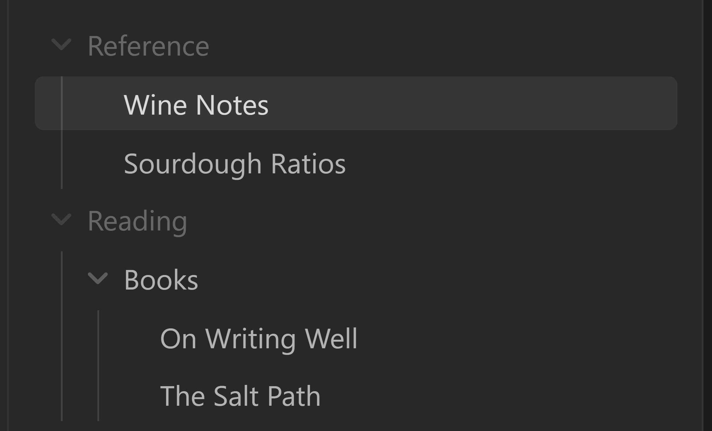
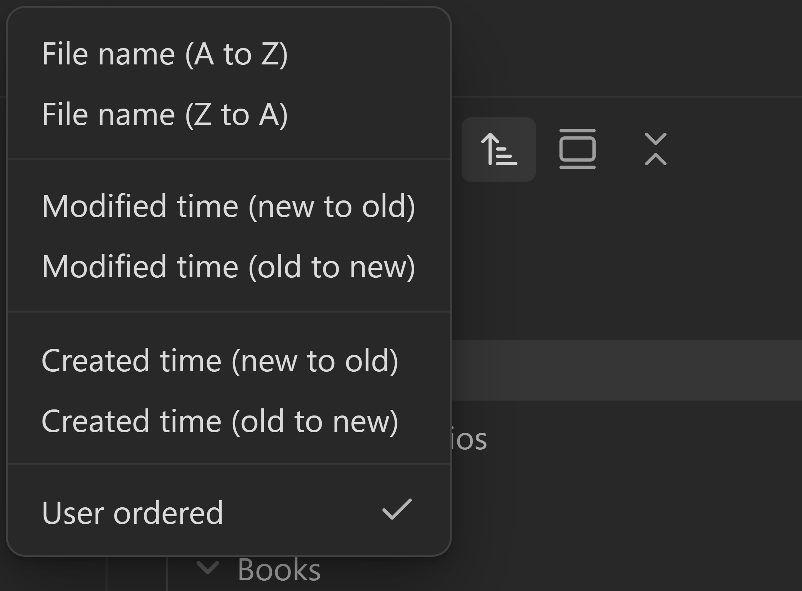
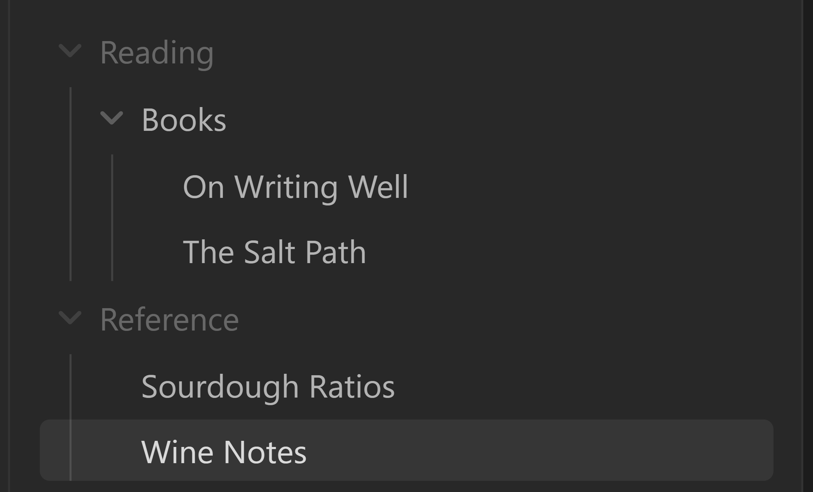

  

> **TL;DR**
>
> - Switch between curated views of your vault's folders and notes
> - Reorder notes and folders by dragging
> - Lightweight: no runtime dependencies, no network requests

`Spaces` is a plugin for Obsidian that supercharges a vault by letting you gather contextually relevant content into a *space*. A *space* is similar in spirit to a Notion teamspace: a view of your vault scoped to one piece of work, with its own contents and its own tabs. It changes what and how you see your vault, not what your vault contains.

Spaces are a lens, not a reorganisation. A note or folder lives at one real path, and can belong to zero or more spaces. Nothing here renames, moves or deletes anything in your vault.

| All | A curated space | A folder pinned space |
|---|---|---|
|  |  |  |

Same vault, same notes, same paths. Only what the explorer shows changes. **All** is Obsidian's own tree, untouched. A **curated space** contains one or more arbitrary item(s) you picked. A **folder pinned space** contains the children of a chosen folder: creating a new note or folder here creates it under that folder's real path.

Navigate spaces by either:

- Clicking a space icon in the space strip
- Clicking your space's icon at the top of the space view
- Using the command palette

## Two kinds of space

**Curated spaces** hold notes and folders you pick by hand. Add a folder and everything inside it comes along; the parent folders needed to reach your files appear dimmed, as scaffolding rather than members.

**Folder pinned spaces** are a live window onto a single folder. Its contents appear at the top level of the explorer, the folder itself is hidden, and anything you later add to that folder shows up without you doing anything. New notes created while you are in the space land in that folder.

A space's type is fixed when you create it: a curated space can never become a folder pinned space, or the reverse.

## How Spaces differs from Workspaces

Obsidian's core **Workspaces** plugin saves and restores *layouts* (which panes, tabs and sidebars are open) and you save and load them by name. It does not change what the file explorer shows.

Spaces works the other way round: it filters the explorer, so picking a space changes which notes and folders exist on screen. Tabs follow as a consequence of switching rather than something you save by hand.

The two overlap on tabs, so Spaces defers. If the core Workspaces plugin is enabled, Spaces stops restoring tabs, says so once, and leaves layouts to Workspaces. Filtering carries on as normal, and the setting you chose is left exactly as you set it.

## Additional features

**Remembers your tabs, if you ask it to.** Turn on **Restore tabs when switching spaces** and each space keeps its own tab layout and sidebar state. It is off by default, so switching moves the file tree and leaves your panes where they are.

**Lets you open anything.** Open a note that is not in the current space and it appears anyway, dimmed and italic, as a *visitor*. Links never lead to nowhere. Visitors last as long as you keep them open in a tab.

**Reorder as you see fit.** Drag rows in the tree to arrange them, remembered separately for each space. Drag the icons in the switcher strip to reorder your spaces.

## Requirements

- **Obsidian 1.13.0 or later**
- **Desktop only.** The manifest declares `isDesktopOnly: true`, so Obsidian does not offer the plugin on mobile

Mobile support is on the roadmap. Two things stand in the way today: reordering rides Obsidian's own HTML5 drag events, which never fire from a touch gesture, and the filtering works against the desktop file explorer's DOM, which mobile lays out differently. Both are solvable, neither is verified on a phone yet, and the manifest stays honest about that until they are.

## Installing

Build Spaces from a local copy of this repository:

    npm install
    npm run build

Then copy `main.js`, `manifest.json` and `styles.css` into `<vault>/.obsidian/plugins/spaces/`, creating that folder if needed. Restart Obsidian or reload the plugin, then enable **Spaces** under Settings → Community plugins.

If your vault uses a custom config folder, substitute it for `.obsidian`.

`main.js` is build output and is not tracked in the repository, so rebuild after pulling or switching branches; otherwise Obsidian keeps loading the previous build.

## Quick start

1. Enable the plugin. The **switcher strip** appears along the bottom of the file explorer, with **All** at the left.
2. Click **`+`** at the right of the strip, or run the **Create space** command. The explorer pane turns into a creation form.
3. Type a name. Optionally click the dashed square to the left of the name to choose an icon, and **Choose icon colour** to set its colour.
4. Choose what goes in it:
   - **Curated** opens a searchable tree of your vault. Click any notes and folders to include them.
   - **Folder pinned** shows folders only; pick exactly one to pin the space to.
   - Both are optional. A space with just a name is a valid empty curated space.
5. Click **Create space**. Spaces switches you into it, and the file tree narrows to match.

| 1. Name it | 2. Curate it | 3. Pin it to a folder |
|---|---|---|
|  |  |  |

Click **All** to leave the space and see the whole vault again.

## Adding and removing things later

Right-click a row in the file tree:

- In **All**, **Add to space** offers each of your spaces.
- Inside a space, **Remove from *space*** removes a member. A row that is in the space because you added its parent folder shows a disabled entry naming the folder it came from. Remove the folder, or use **Stop showing here** to dismiss a visitor.
- On a folder in **All**, **Create folder pinned space** builds a space pinned to it in one step.

Right-click a space's icon in the switcher strip for **Rename space…**, **Change space icon…**, **Change space colour…**, and **Restore saved ordering**.

| A row in the file tree | A space's icon in the strip |
|---|---|
|  |  |

Only spaces that can take the row are offered: a folder pinned space is a window onto its own folder, so it never appears in **Add to space**.

## Sorting

Drag a row in the file tree and that arrangement is saved for the space you are in. Spaces keeps those orders separately for each space and for **All**, and nothing moves on disk.

You are not stuck with a hand-made order. Use the file explorer's own sort button and pick any of Obsidian's modes, and the space renders with that instead. Your saved order is set aside, not discarded, and it comes back untouched.

| 1. Your order | 2. Obsidian's sort menu | 3. One of its modes |
|---|---|---|
|  |  |  |

Spaces adds **User ordered** to that menu as a seventh mode, ticked when your saved order is what you are looking at. Picking it is one of three ways back:

- **User ordered** in the sort menu. It appears once the space has an order to return to, so a space you have never dragged a row in will not show it.
- **Restore saved ordering** on the right-click menu of a space's icon in the strip.
- The **Restore saved ordering** command, which also covers **All**.

Two things worth knowing:

**Which mode is Obsidian's, not the space's.** What Spaces remembers per space is whether to show your order or Obsidian's sort. The sort mode itself is Obsidian's single setting, so putting one space in A to Z and another in modified-time at the same time is not something this can do. One space on your order and another on Obsidian's sort works fine.

**Your orders sync; the choice between them does not.** Saved orders live in `data.json` and travel with your vault. Which spaces are currently showing Obsidian's sort is local to each device, so the same space can show your order on one machine and Obsidian's sort on another.

While a space is showing Obsidian's sort, dragging rows in it is switched off, and Spaces says so once rather than silently ignoring the drag.

## Commands

All available from the command palette, and bindable to hotkeys.

| Command | What it does |
|---|---|
| Switch to All | Leaves the active space and shows the whole vault |
| Next space / Previous space | Cycles through your spaces |
| Create space | Opens the creation form in the explorer pane |
| New note in active space | Creates a note, in the pinned folder if the space has one |
| New folder in active space | Creates a folder, in the pinned folder if the space has one |
| Add active file to space | Adds the file you are editing to a space you choose |
| Pause or resume space filtering | Releases the explorer entirely, showing Obsidian's own unfiltered tree |
| Restore saved ordering | Returns to your own row order after switching to one of Obsidian's sort modes (see [Sorting](#sorting)) |

## Settings

Settings → Spaces has two pages. **Preferences** holds the toggles below; **Spaces** lists your spaces, where you can rename one, review its members, or delete it. Every setting here is findable from Obsidian's own settings search.

| Setting | Default | What it controls |
|---|---|---|
| Show the space name above the file tree | On | A header row naming the active space |
| Mark folder pinned spaces with a pin | Off | Adds a pin to that header for a folder pinned space; hover it for the folder |
| All stays at the left of the space strip | Off | Keeps **All** in place while the other icons scroll |
| Assign a colour to new spaces | On | New spaces take the next palette colour. Off, they start neutral and you pick |
| Show files you open that are not in this space | On | Whether visitors appear. Off, a non-member note you open stays hidden |
| Ignored paths | Empty | One glob per line, hidden from every space. `*` matches within a path segment, `**` across segments. A file you added explicitly is still shown |
| Allow reordering of space items | On | Whether dragging rows rearranges them inside a space |
| Allow reordering outside spaces | On | The same, for **All** |
| Restore tabs when switching spaces | Off | Whether each space restores its own tabs. On, switching also rearranges your panes; off changes nothing about which rows are visible |

## Your files and your data

Spaces never creates, renames, moves or deletes notes as part of managing a space. The two creation commands above make files because you asked them to; everything else only changes what the explorer shows.

Spaces, settings and saved row orders live in `data.json` inside the plugin's own folder. Tab layouts and the selected space are kept in Obsidian's local storage for the vault.

The plugin makes no network requests. A test (`tests/noNetwork.test.ts`) scans the source for `fetch`, `requestUrl` and socket calls and asserts there are none, and that the plugin ships no runtime dependencies.

## Limitations

- One active space per window, applied to every file-explorer leaf.
- A space's kind is fixed at creation: a curated space cannot become folder pinned, or the reverse.
- Dragging to reorder rows or spaces needs a pointer; both gestures stand down on touch.
- The item picker in the creation form draws at most 200 rows at a time and tells you how many more matched. Keep typing to narrow it.

## Development

    npm install
    npx tsc --noEmit    # strict type check
    npx vitest run      # the test suite
    npm run build       # type check, then bundle to main.js

## Support

If Spaces earns a place in your vault: [Ko-fi](https://ko-fi.com/psjdev) for a one-off, or [GitHub Sponsors](https://github.com/sponsors/psjdev).

## License

MIT. See [LICENSE](LICENSE).
